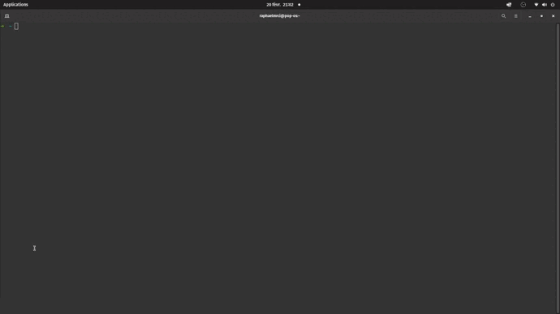
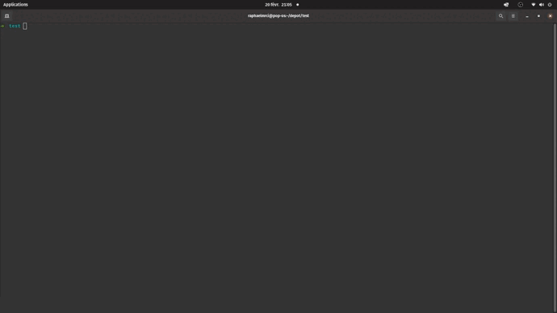
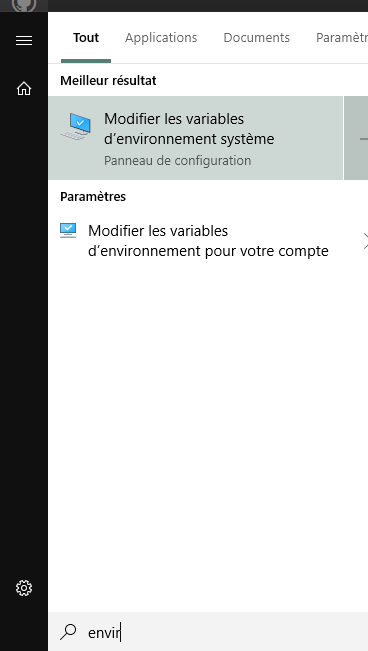
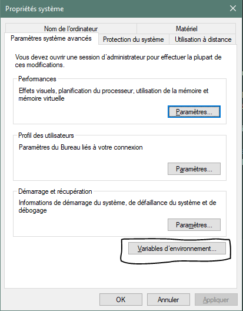
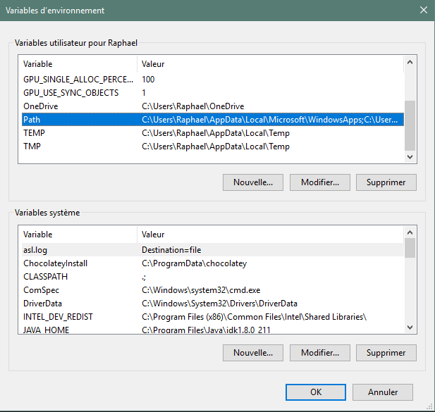
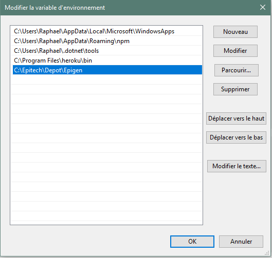

# { EPIGEN. }

Simple usage program to start any Epitech project.
Improve your efficiency, execute just this program, and your project template will be generated, for any epitech project.




## MENU

-   [Installation](#installation)
-   [Usage](#usage)
-   [Options](#options)
    -   [To Do](#to-do)

## INSTALLATION

### GNU/LINUX

To install Epigen, you just have to execute this following line on Linux:

```
sudo bash -c "$(curl -fsSL https://raw.githubusercontent.com/raphaelMrci/Epigen/main/install_epitech_gen.sh)"
```

<details>
  <summary>WINDOWS</summary>

### WINDOWS

To install EPIGEN on your Windows computer, you must follow those steps:

-   Download Epigen project zipped folder [(download here)](https://github.com/raphaelMrci/Epigen/archive/refs/heads/main.zip)
-   Unzip it where you want (I suggest you to put it on your Program Files, but you are free on this point)
-   Add the program directory to the PATH: - Press Win button, and type `envir...`. Windows must suggest you something like `edit the system environment variables`. Open it.



-   Click on `Environment variables`.



-   You will see a window with your user variables. Under this field, click on `Path` variable.



-   A list will appear. Click on a blank field, and write your Epigen folder path.



<details>
    <summary>For clean installation (optional)</summary>
The Windows installation is not perfect. Some files are useless, so you can remove them.

-   .github
-   .git
-   assets
-   epitech_gen.sh
-   install_epitech_gen.sh
-   READEME.md
-   uninstaller.sh
</details>
Congratulations, you can now use Epigen on your Windows device !
</details>

## USAGE

`epigen project_name [OPTIONS]`

Launch the program on your desired directory, and everything will be setted up

## OPTIONS

-   `-h` or `--help`: print help
-   `-v` or `--version`: print current version
-   `-u` or `--update`: update Epigen
-   `-il` or `--ignore-lib`: ignore lib include
-   `-l` LIB_PATH: define your lib path (specify full path)
-   `-p`: Python project generation (BETA)
-   `-g` or `--csfml`: CSFML project generation

## TO DO

-   .gitattribute
